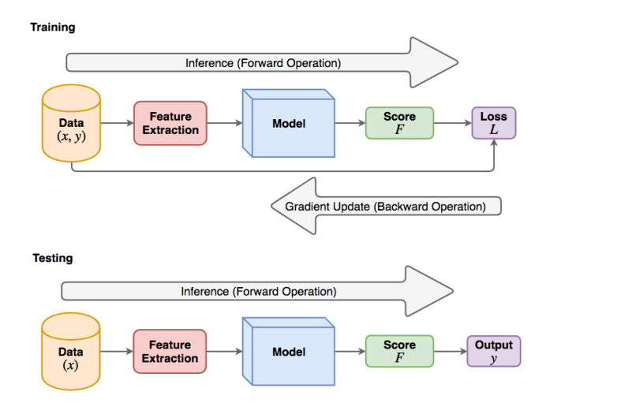
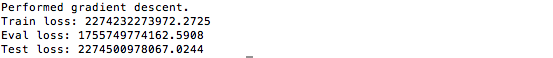

## Title
Linear Model: Predicting Housing Prices

## Purpose
This project aims to train a linear model to predict housing prices.

## Pipeline

## Process
**Data processing.**  
In utils/data tools.py , we will implement functions to transform the data into vector forms. For example, converting the location column into
one-hot encoding. There is a total of five types of buildings, 1Fam, 2FmCon, Duplx, TwnhsE, TwnhsI. In order to represent this, we construct a vector of length five, one
for each type, where each element is a Boolean variable indicating the existence of the building type.   

**Linear model implementation.**  
In models/linear model.py , we will implement an abstract base class for linear models, then we will extend it to linear regression.
The models will support the following operations: 
- **Forward operation.** Forward operation is the function which takes an input and outputs a score.  
- **Loss function.** Loss function takes in a score, and ground-truth label and outputs a scalar. The loss function indicates how good the models predicted score
fits to the ground-truth. We will use L to denote the loss.  
- **Backward operation.** Backward operation is for computing the gradient of the loss function with respect to the model parameters. This is computed after the
forward operation to update the model. 

**Optimization** 
- **Gradient descent.**  In models/train eval model.py, we will implement gradient descent. 
- Linear regression also has an analytic solution, which we will also implement. 

**Model Selection** 
For the optimization above, it is about learning the model parameters w. In this case, we use the training split of the dataset to \train" these parameters. Additionally, there are several hyper-parameters in this model, (e.g. learning
rate, weight decay factor, the column features). These hyper-parameters should be chosen based on the validation split (i.e. for each hyper-parameter setting, we find the
optimal w using the training set then compute the loss on the validation set; We will choose the hyper-parameters with the lowest validation error as the final model.

## How to Run The Program
Run main.py

## Result Preview

