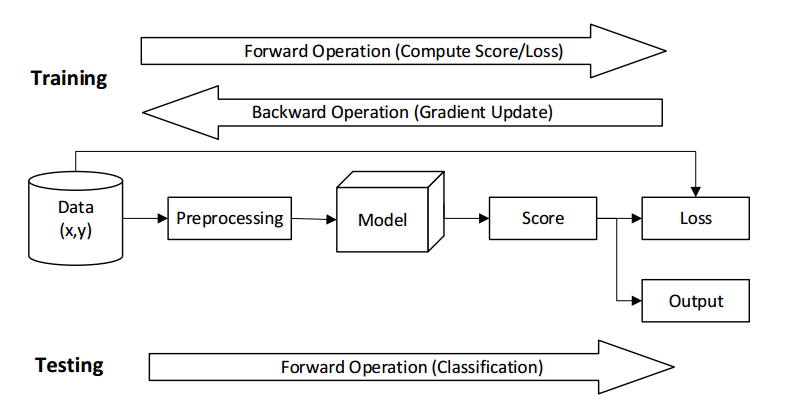
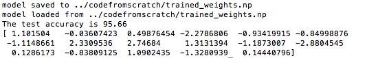
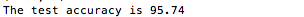

## Title 
Logistic Model: Separate Two-class Audio Datasets

## Purpose
Build a logistic model based binary classifier that can separate twoclass audio datasets. To be specific, the datasets consist of features extracted from audio waveforms of letters of the alphabet. The two classes represent **the ee-set (b,c,d,e,g,p,t,v,z)** and **the eh-set (f,l,m,n,s,x)**, respectively. 

In this project, we will use two forms to build logistic model:  
(1) Manually build the model. (scratch part)
(2) Use tensorflow to build the model (tf part)

## Pipeline

## Scratch Implementation Process
**Reading and Preprocessing Data.**  
In io tools.py , we will fill in one function for reading in the dataset as well as preprocessing it.  
Specifically, the trainset" has an "indexing.txt" and a folder "samples", where the former file lists all samples
line-by-line in the form of class label sample file.txt" and the latter folder contains all sample files in ASCII text format. For more details, check the "README.txt". After the dataset is read, it should be preprocessed to match the specified form in return arguments of the function. 

**Logistic Model**  
In logistic model.py, we will implement a class for logistic models and use it for binary classification. The class will support the following operations: 
- **Forward operation**  
Forward operation is the function which takes input features and generate a probability score. 
- **Backward operation**  
Backward operation is for computing the gradient of the loss function with respect to the model parameters. 
- **Classify operation**  
Classify operation performs the binary classification on input dataset.  
- **Fit operation** 
- **Save/Load operation**  
After training with hundreds or thousands of iterations, the final model should be saved into a binary file using the methods np.tofile(‘trained weights.np’) and np.fromfile(‘trained weights.np’), so that, in future, the well-trained model can be restored immediately and perform classification tasks.  

## TensorFlow Implementation Process
**Reading and Preprocessing Data.**  
Same as above.  

**Logistic Model**
 - **Build Graph operation.**
 - **Fit Operation.**
 
 ## How to Run The Program
 open two "main.py" files in "codefromscratch" and "codefromtf" folders to build the model and see its accuracy. 
 
 ## Results Preview
 
 

