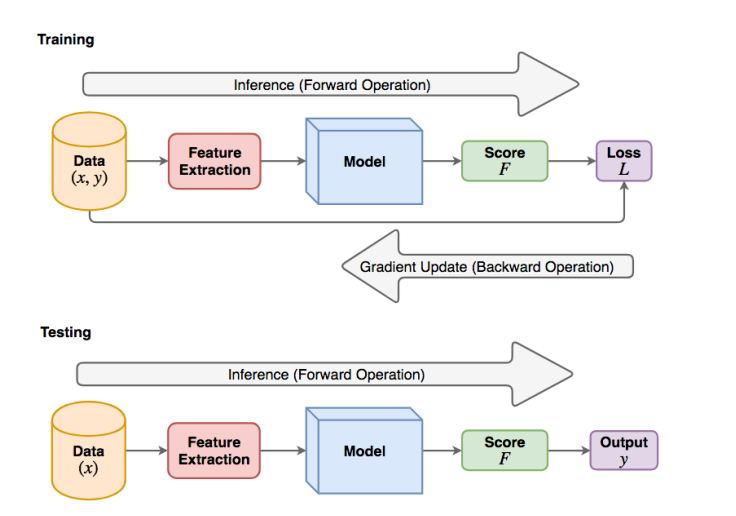
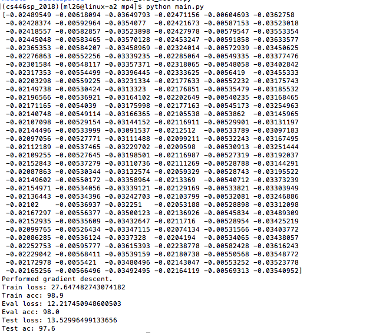

## Title
SVM: Separate Gray-scale Images and Color Images

## Purpose
The main purpose of this project is to build a SVM model to classify between gray-scale and color images. 
The dataset looks like follows:  

## Pipeline

## How to Use The Program
(1) Unzip the data.zip file  
(2) Run main.py  

## Results Preview

