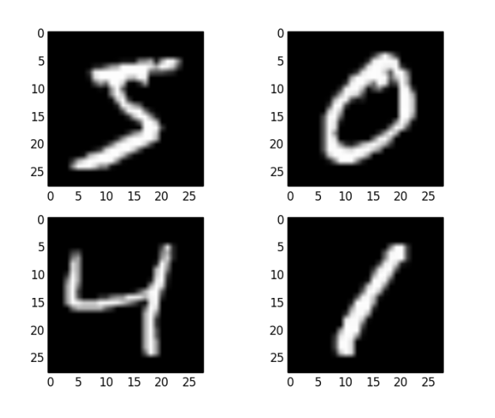
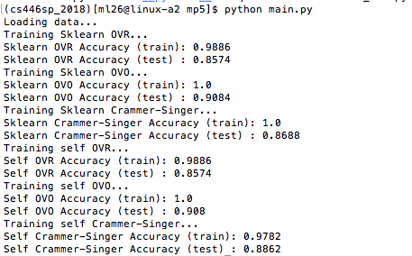

## Title
SVM: Recognize Handwritten Digits

## Purpose
- This project aims to build a multiclass SVM to recognize handwritten digits.  
- The dataset we use is MNIST handwritten digit database, where every handwritten digit image is represented as  
28 × 28 pixels, each with value 0 to 255. We want to classify each image as one of 0 to 9.  
- Dataset:  

## Three Methods to Build the SVM Model
- **Using Built-in Multiclass Functions**  
We will use Scikit Learn’s **sklearn.multiclass.OneVsRestClassifier** and **sklearn.multiclass.OneVsOneClassifier** to perform multiclass classification.

- **Implementing One-vs-Rest and One-vs-One Classification**  
We will use sklearn.svm.LinearSVC only with binary labels, 0 and 1.

- **Implementing Multiclass SVM manually**  
We will implement our own loss function of (Crammer-Singer) multiclass linear.

## Results Preview

