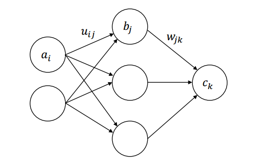
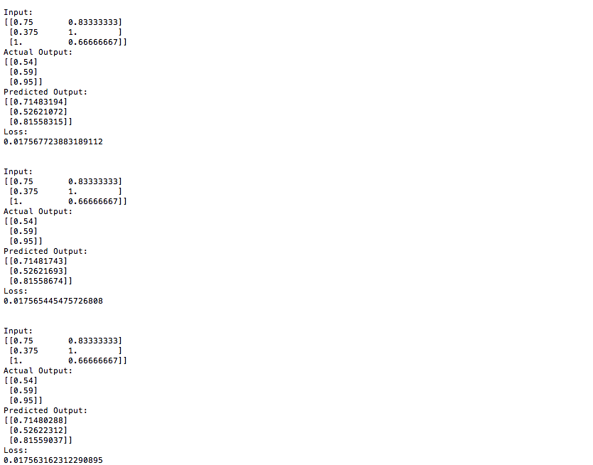

## Title
Implement A Simple Deep Net

## Purpose
This project aims to implement a simple deep net whose structure is: 

The deep net should be implemented from scratch in python (i.e. forward pass and back-propagation) without using Tensorflow, Pytorch, Chainer etc. 

## How to Run The Program
Run "back prop.py" file

## Results Preview
Following is just a part of the result:  

